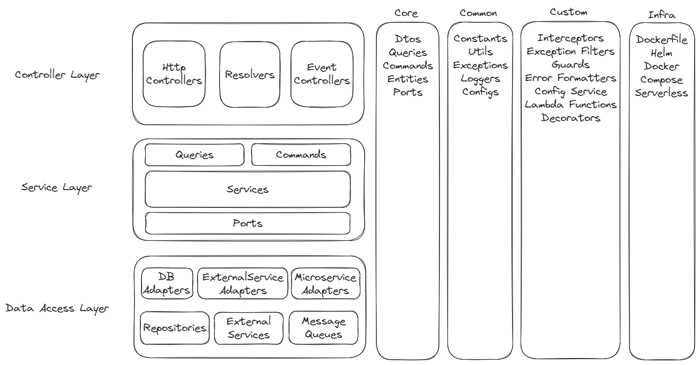

# Flexible 3Tier Layered Architecture
Layered Architecture를 기반으로 고품질 코드를 추구하는 아키텍처입니다. 

비록, 완벽하지 않더라도 완벽함을 추구합니다.

중요한 것은 현재보다 나은 내일이며, 완벽함을 추구하기에 완벽함에 수렴하게 됩니다.

## WHY FLEXIBLE
아래의 유연함을 추구합니다.

- 하나, 다른 아키텍처로의 이관이 가능합니다.
- 하나, 다른 프레임워크 또는 다른 플랫폼으로의 이관이 가능합니다.

## 목적
아래의 설계방향을 추구합니다.

- 하나, 동일 Layer의 모듈들은 서로를 참조하지 않습니다.
- 하나, 저수준 모듈이 고수준 모듈을 참조하지 않습니다.
- 하나, 서비스 모듈의 재사용성과 테스트 용이성을 저해하지 않습니다.

## Diagram

