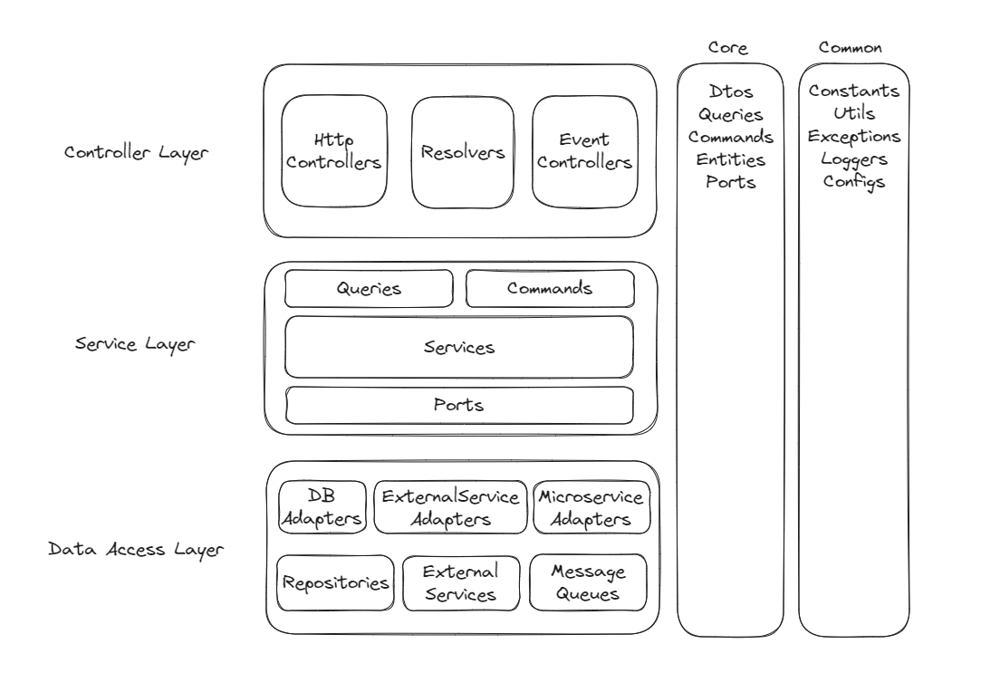

# Flexible 3Tier Layered Architecture
This architecture strives for high-quality code based on the Layered Architecture.

Even though it may not be perfect, it seeks perfection.

The key is to aim for a better tomorrow than today and converge towards perfection in the pursuit of perfection.

## WHY FLEXIBLE
Pursue the following flexibility:

- Allows for migration to different architectures.
- Allows for migration to different frameworks or platforms.

## 목적
We pursue the following design principles:

- Modules within the same layer do not reference each other.
- Low-level modules do not reference high-level modules.
- It does not hinder the reusability and testability of service modules.
## Diagram

